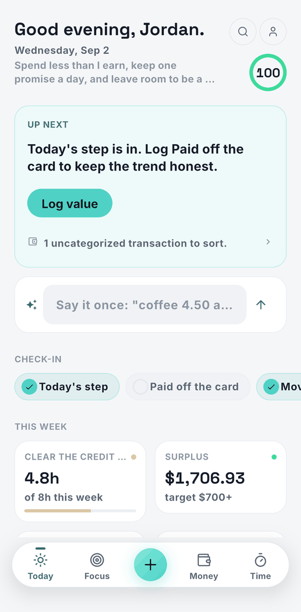
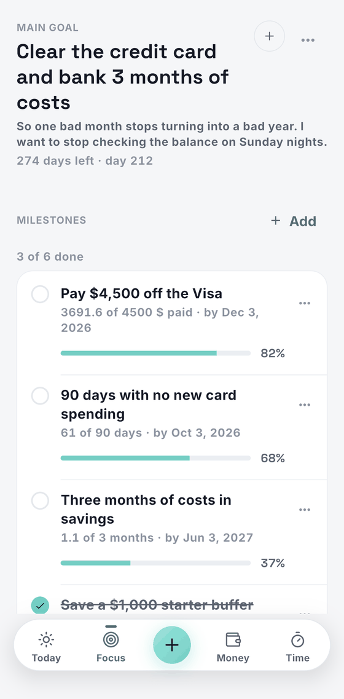
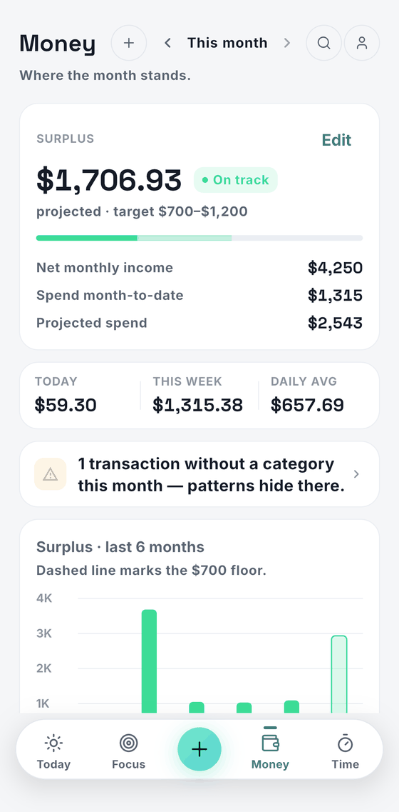
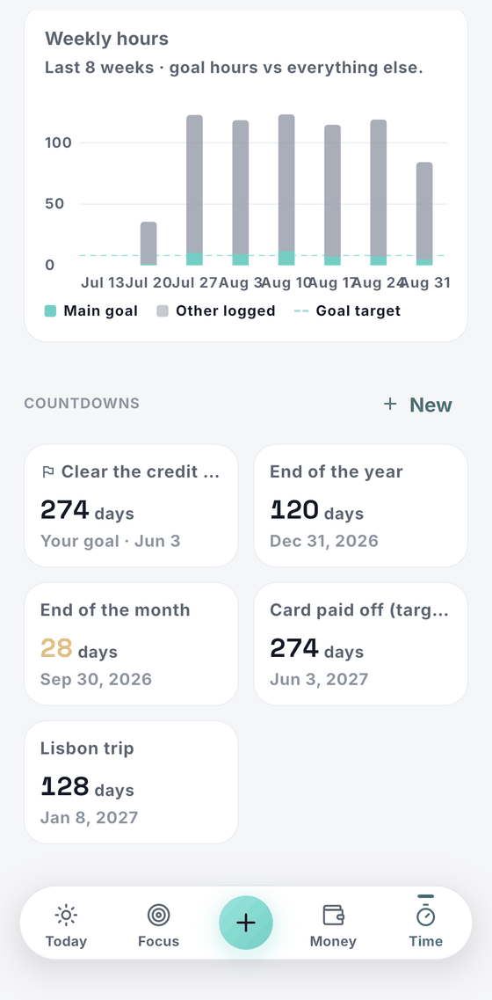
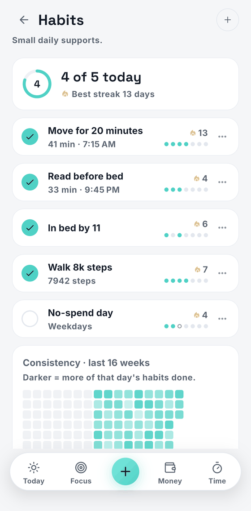
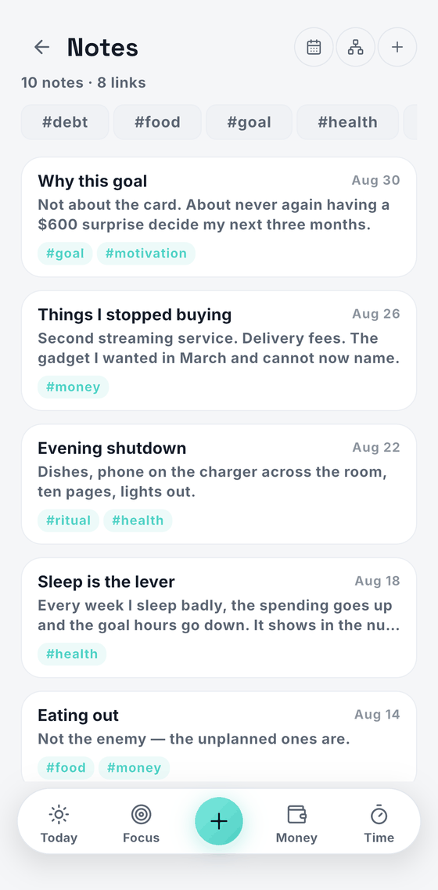

<div align="center">


# Life Assist

**One quiet place to run your life.**

[](https://github.com/saitokiku/lifeassistAI/actions/workflows/ci.yml)
[](LICENSE)


</div>

Life Assist is a local-first personal operating system built around a
simple idea: **pick one main goal, keep it in front of you, and keep the
rest of life — money, time, habits, ideas — honest with light logging.**
No cloud, no account, no analytics; your data lives in SQLite on your
device and exports to a JSON file you own.

<div align="center">

<table>
<tr>
<td align="center"></td>
<td align="center"></td>
<td align="center"></td>
</tr>
<tr>
<td align="center"><sub><b>Today</b><br>the day's score, one thing up next</sub></td>
<td align="center"><sub><b>Focus</b><br>one goal, in your words, with milestones</sub></td>
<td align="center"><sub><b>Money</b><br>projected surplus, budgets, exact cents</sub></td>
</tr>
<tr>
<td align="center"></td>
<td align="center"></td>
<td align="center"></td>
</tr>
<tr>
<td align="center"><sub><b>Time</b><br>the week in hours, against your targets</sub></td>
<td align="center"><sub><b>Habits</b><br>streaks that forgive one miss a week</sub></td>
<td align="center"><sub><b>Notes</b><br>a Zettelkasten with links, tags, backlinks</sub></td>
</tr>
</table>

<sub>Every screen above is <a href="demo/life_assist_demo.json"><code>demo/life_assist_demo.json</code></a> —
import it and the app looks like this on your own device.</sub>

</div>

## How it's organized

Five tabs — **Today · Focus · Money · Time · You** — on a shared design
system (bundled Inter + Space Grotesk, dark-first, one component library).

- **Today** — what matters now: a greeting, one "Up next" action chosen
  from your real state, one-tap check-ins (goal step, tracked measure,
  habits), the week's key numbers, a snapshot of your goal, and the long
  game. On Apple-Intelligence iPhones a smart-capture field turns
  "coffee 4.50 and 2h deep work" into draft chips you confirm. Evenings
  add a one-line journal prompt.
- **Focus** — your main goal, in your words ("Kaizen", "Finish nursing
  school", "Become debt-free"…): why it matters, timeframe, milestones to
  check off, an optional progress measure with trend charts, and a daily
  step log with honest worked / adjust / didn't-work reviews. Goals can be
  edited, paused, completed, or replaced; history stays.
- **Money** — monthly income vs spending: projected surplus, leak flags,
  budget categories, a transaction log, recurring expenses that land as
  real transactions, tracked accounts with net-worth history, bank-CSV
  statement import with duplicate detection (and on-device AI category
  suggestions), surplus history, and the long game. **All money is stored
  as integer cents — sums are exact, always.**
- **Time** — weekly hours against targets, a persistent focus timer
  (mirrored as a lock-screen Live Activity on iOS), available time today,
  a goal-vs-everything-else history chart, countdowns, and the time log.
- **You** — the person behind the data: your personal line, operating
  principles, and the supporting systems — Habits (with optional Apple
  Health auto-checks), Ideas (a 7-day cooling parking lot), Reminders,
  Journal (one honest line at a time), **Notes** (a built-in
  Zettelkasten: markdown, `[[wiki links]]`, `#tags`, backlinks, an
  auto-drawn graph, and an Obsidian-compatible `.md` vault in the Files
  app — see [docs/NOTES_ZETTELKASTEN.md](docs/NOTES_ZETTELKASTEN.md)),
  and Settings — each with a live status line. Search covers everything
  you've written.

First launch runs a four-step onboarding: what the app is → your main
goal (skippable) → your name and areas → a light daily rhythm. Every
answer is optional and everything can be changed later.

## Siri, on-device AI, and widgets (iOS)

The centerpiece. Built on App Intents — the only rail iOS 26/27's Siri
AI drives — with three bridges between Dart and Swift:

- **Siri saves with the phone locked.** "Log a 12 dollar expense on
  groceries in Life Assist" writes a capture record without launching
  the app; the app imports it exactly once on next open. Expenses, time,
  ideas, reminders (which fire before the app ever opens), and habit
  checks. Unknown category names are kept, never guessed.
- **Siri answers.** "What's next in Life Assist", "How's my grocery
  budget" — answered from a today-stamped feed, and only when the feed
  really is from today; otherwise Siri says to open the app. Every
  capture shows a receipt snippet and is voice-undoable.
- **On-device AI (iOS 26+, Apple Intelligence).** Foundation Models
  guided generation parses free-text captures, suggests statement
  categories (constrained to your real category names), drafts weekly
  reflections from your numbers, and expands parked ideas. Draft-only —
  nothing writes without your confirmation.
- **Widgets + Live Activity.** Today's score, up-next, an interactive
  habit check (writes the same queue record Siri does), a Control Center
  button (iOS 18+), and the focus-timer Live Activity. Widgets need the
  App Group capability (one Mac-side click); until then they honestly
  say to open the app.
- **Apple Health auto-habits.** Map a habit to steps, sleep, mindfulness,
  or workouts; the day's data checks it off. Your own log always wins
  over the automatic one. Ships dormant — enabling is a two-switch
  Xcode step (see release doc).

One binary serves iOS **17 through 27**: everything newer than the floor
is availability-gated, so features light up with the OS instead of
forking builds.

## Tech stack

Flutter (Material 3, dark mode first) · Dart · flutter_riverpod ·
go_router (StatefulShellRoute — tabs keep their state) · drift + SQLite
(drift_flutter, sqlite3_flutter_libs) · flutter_local_notifications +
timezone · shared_preferences (small app flags only) · intl · uuid ·
csv (statement import) · fl_chart plus a custom-painted sparkline ·
share_plus + file_picker (backup export/import) · package_info_plus ·
bundled Inter + Space Grotesk fonts (OFL, licenses in `assets/fonts/`).

Native iOS (Swift, no plugins): App Intents + entity queries over a JSON
mirror, a file-based capture queue, Foundation Models
(`lifeassist/ai`), HealthKit (`lifeassist/health`), ActivityKit
(`lifeassist/activity`), WidgetKit extension (`ios/LifeAssistWidgets/`),
and a privacy manifest. The Xcode extension target is generated by
`scripts/ios/add_widget_extension.rb` and committed.

Architecture: clean-ish layers per feature — `data/` (repositories over
drift), `domain/` (models + pure rules), `application/` (Riverpod
providers + derived state), `presentation/` (screens/widgets). Native
bridges live under `lib/core/{native,ai,health}/`. Design tokens in
`lib/core/theme/`, shared components in `lib/shared/widgets/`.

### Data schema & migrations

Current schema: **v7**. Every upgrade (and old backup import) is
automatic and tested:

- **v2** — the universal main-goal system; Kaizen-era data becomes the
  user's own goal, nothing lost.
- **v3** — accounts, recurring expenses, weekly reviews, weekday
  schedules, indexes.
- **v4** — **money becomes integer cents** (exact sums; proven against a
  planted v3 database file with adversarial floats) + the journal.
- **v5** — Apple Health habit mappings + a source tag on every habit log
  (`manual | siri | health` — manual always wins).
- **v6** — the Zettelkasten: notes plus their derived link/tag index
  (rebuilt from note text on every save and after imports).
- **v7** — UNIQUE constraints behind the three "one row per day"
  invariants, and stored notification ids (a `String.hashCode`
  derivation is not stable across platforms, so pending notifications
  could become uncancellable).

Backups are versioned JSON stamped with the schema version; every older
version imports with conversion. See `lib/core/storage/`,
`test/money_migration_test.dart`, and `test/schema_upgrade_test.dart`.

## Run it

```bash
flutter pub get
dart run build_runner build --delete-conflicting-outputs   # regenerate drift code (already checked in)
flutter run                # pick a device/simulator
```

Useful scripts (all in `scripts/`):

| Script | Does |
| --- | --- |
| `analyze.sh` | `flutter pub get` + `flutter analyze` |
| `test.sh` | full test suite |
| `run_ios.sh [device-id]` | debug run on iPhone/simulator |
| `build_ios_release.sh` | clean → analyze → test → `flutter build ios --release` |
| `build_ipa_release.sh` | same, then `flutter build ipa --release` |
| `ios/add_widget_extension.rb` | regenerates the widget target (no-op when present) |

## Demo data

`demo/life_assist_demo.json` is a full backup for a fictional customer —
five months of goal, money, time, habit, journal and note history.
Import it (You → Settings → *Import backup*) and the app looks lived-in
instead of empty. It doubles as the fixture for the import/export tests.

```bash
python3 scripts/generate_demo_data.py            # re-date it to today
python3 scripts/generate_demo_data.py --now 2026-12-24
```

Every date is relative to the anchor day, so regenerate before a demo.
See [demo/README.md](demo/README.md) for the persona, the tour, and why
a late-month anchor shows the Money screen at its best.

## Test & CI

```bash
flutter test
```

281 tests: focus score, money projections and flag rules (in exact
cents), the v3→v4 migration against a real database file, backup
round-trips and version conversion, capture-queue idempotency and undo,
the entity mirror, CSV parsing, Health sync rules (manual-wins), AI and
Health channel contracts, time/habit/idea repositories, and smoke tests.

Two GitHub Actions workflows: `ci.yml` (ubuntu — analyze + tests on
every push) and `ios.yml` (macOS — Swift typecheck, then a full device
build producing a sideloadable **unsigned IPA artifact** on every
iOS-touching push). The macOS workflow is the Xcode for non-Mac
development; it has caught real Swift errors.

## Build for iPhone / TestFlight

Requires macOS with Xcode and an Apple Developer account. Short version:

```bash
flutter build ipa --release   # .ipa in build/ios/ipa/
```

Then upload with Transporter. Signing, the exact TestFlight walkthrough,
and the two optional capability switches (HealthKit, App Group for
widgets) are in [docs/release_ios.md](docs/release_ios.md); store
metadata lives in [docs/app_store_listing.md](docs/app_store_listing.md).

## Project structure

```
lib/
├── main.dart / app.dart / bootstrap.dart
├── core/            constants, theme, utils (incl. money = cents), storage
│                    (drift + migrations), notifications, native bridges
│                    (queue drain, mirror, live activity), ai/, health/
├── routing/         go_router config
├── shared/          layout (adaptive nav, app shell) + reusable widgets
└── features/
    ├── dashboard/   Today — aggregated state + the Up-next engine
    ├── focus/       the main goal: milestones, measures, daily steps
    ├── money/       budgets, transactions, accounts, recurring, CSV import
    ├── time/        budgets + blocks + timer + countdowns
    ├── habits/      habits + logs (+ Apple Health mappings)
    ├── ideas/       parking lot with the 7-day cooling rule
    ├── journal/     one honest line at a time
    ├── identity/    personal line + operating principles
    ├── reminders/   local notifications
    ├── search/      everything you've written
    ├── review/      the weekly review ritual
    ├── settings/    settings + backup + diagnostics
    ├── you/         the You hub
    └── onboarding/  first-launch flow
ios/Runner/          AppDelegate + App Intents + bridges + privacy manifest
ios/LifeAssistWidgets/  WidgetKit extension (widgets, control, Live Activity)
demo/                a fictional customer's backup + its generator's output
docs/                data model, scoring rules, release + store docs
scripts/             analyze/test/run/build helpers, widget target generator,
                     demo-data generator
test/                281 unit/repository/contract/smoke tests
```

Reference docs: [data_model.md](docs/data_model.md) (every table and
what it means), [scoring_rules.md](docs/scoring_rules.md) (how the day
score is computed), [NOTES_ZETTELKASTEN.md](docs/NOTES_ZETTELKASTEN.md),
[BANK_CONNECTIONS.md](docs/BANK_CONNECTIONS.md),
[SIRI_SETUP.md](docs/SIRI_SETUP.md),
[release_ios.md](docs/release_ios.md), and
[roadmap.md](docs/roadmap.md).

## Current limitations

- **Web**: drop `web/sqlite3.wasm` in for persistence (see
  `web/README.md`); without it the web build runs in-memory. No
  notifications, Siri, or AI on web — iOS is the primary target.
- **Siri/AI floors**: background Siri capture needs iOS 17+; entity
  schemas and Siri AI shine on 26/27; on-device AI needs an
  Apple-Intelligence device on iOS 26+. Everything degrades honestly.
- **HealthKit and the widget App Group are LIVE**: entitlements are
  committed for both targets and `LAHealthKitEnabled` is on. First
  archive on a new Mac lets automatic signing register the
  capabilities; see [docs/release_ios.md](docs/release_ios.md).
- **No cloud sync / calendar overlay** — deferred deliberately: both
  compromise the local-first, no-account stance if rushed.
- Reminders use inexact Android alarms; on iOS times are exact but
  require notification permission.

## License

Apache License 2.0 — see [LICENSE](LICENSE).
